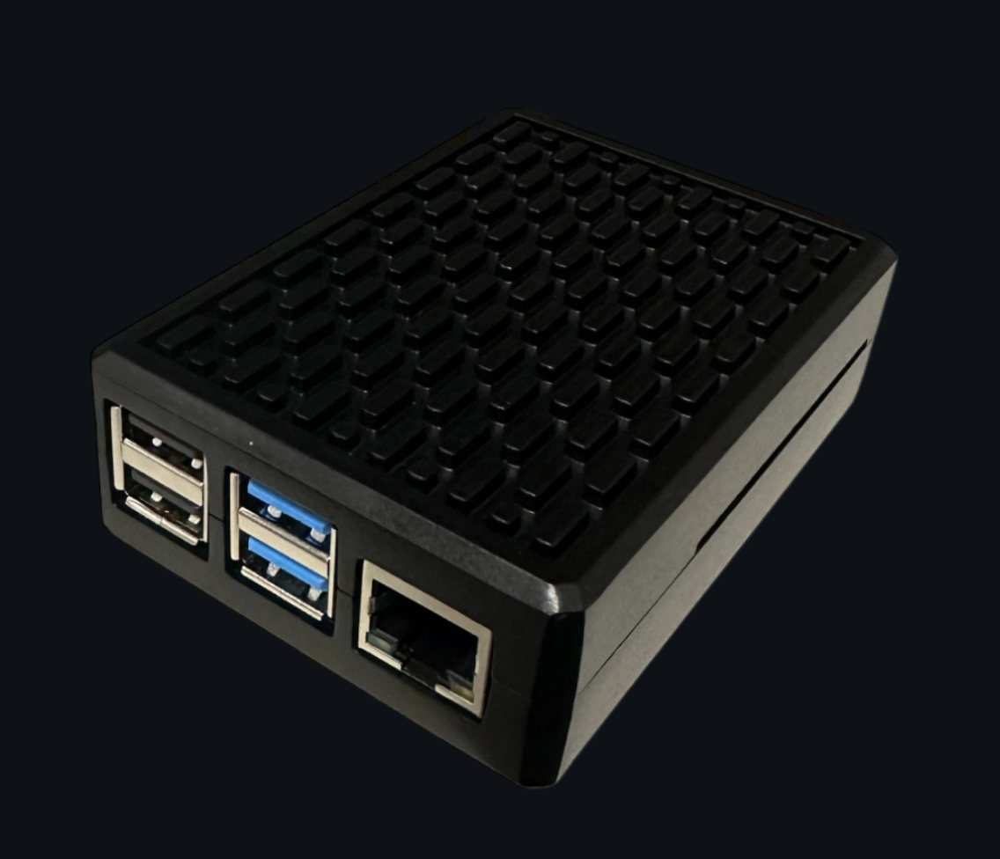

# Necris NAS


Necris NAS transforms your Raspberry Pi into a powerful Network Attached Storage (NAS) server that makes USB drives accessible over your local network. Connect USB drives to your Raspberry Pi and instantly access them from any device on your home network - computers, tablets, phones, smart TVs, and more!

## What Necris NAS Does

Necris NAS creates a seamless, hassle-free storage experience by transforming your Raspberry Pi into a central hub for all your USB drives. Here's what your experience will be like:

1. **Plug and Share** - Simply plug any USB drive into your Raspberry Pi, and within seconds it's automatically available on your network. No manual mounting, no configuration, no complex commands.

2. **Access Anywhere** - Browse and manage your files from any device - laptop, phone, tablet, or smart TV. Whether you're streaming movies to your TV, backing up photos from your phone, or working on documents from your computer, all your files are just a few clicks away.

3. **One Unified System** - Instead of juggling multiple external drives between different devices, all your storage is consolidated in one place. Your Raspberry Pi stays quietly running in the background, making all your USB drives available 24/7.

4. **Monitor and Manage** - The clean web interface lets you see all connected drives, their storage capacity, and usage at a glance. Upload, download, and organize files directly from your browser, and easily manage sharing settings.

   

5. **Worry-Free Operation** - The system monitors itself, automatically recovering from errors and alerting you when drives are getting full. Even after power outages or reboots, your drives automatically reconnect and resume sharing.

## Requirements

### Hardware

- Raspberry Pi (any model with USB ports - Pi 3 or newer recommended)
- MicroSD card (8GB or larger)
- Power supply for your Raspberry Pi
- USB storage drive(s) - USB flash drives, external hard drives, or SSDs
- Home network with Wi-Fi (or Ethernet for wired connection)

### Software

- Raspberry Pi OS (Bullseye or newer)
- SSH enabled (for headless setup)

## Installation

### 1. Set up Raspberry Pi OS

1. Download and install [Raspberry Pi Imager](https://www.raspberrypi.org/software/)
2. Insert your microSD card into your computer
3. Open Raspberry Pi Imager and choose Raspberry Pi OS (32-bit or 64-bit)
4. Go to OS customization settings in the imager:
   - Set hostname (e.g., `necris-hostname`)
   - Enable SSH
   - Set username and password
   - Configure wireless LAN with your Wi-Fi credentials
   - Set locale settings
5. Write the OS to the SD card
6. Insert the SD card into your Raspberry Pi and power it on

### 2. Install Necris NAS

Connect to your Raspberry Pi via SSH:

```bash
ssh username@necris-hostname.local
```

Clone the repository and run the setup script:

```bash
git clone https://github.com/zenentum/necris
cd necris
chmod +x setup.sh
sudo ./setup.sh
```

The setup script will:
- Install required packages
- Set up Samba for file sharing
- Configure services for auto-start
- Create default credentials

Once the setup is complete, the web server and USB sharing services will automatically start on boot. This means your NAS will be operational anytime your Raspberry Pi is powered on, even after reboots.

If you need to stop the services:
```bash
# Stop the NAS service
sudo systemctl stop necris-nas

# Disable auto-start on boot
sudo systemctl disable necris-nas

# To start the service again
sudo systemctl start necris-nas

# To re-enable auto-start
sudo systemctl enable necris-nas
```

## Usage

### Accessing the Web Interface

1. Open a web browser on any device connected to your home network
2. Go to `http://necris-hostname.local` (replace with your Pi's hostname)
3. Log in with default credentials:
   - Username: `necris-client`
   - Password: `necris-is-awesome`


### Connecting USB Drives

1. Simply plug USB drives into your Raspberry Pi's USB ports
2. The drives will be automatically detected, mounted, and shared
3. Refresh the web interface to see the newly connected drives

### Accessing Shared Drives from Other Devices

#### Windows

1. Open File Explorer
2. In the address bar, type: `\\necris-hostname.local`
3. Enter your credentials when prompted

#### macOS

1. In Finder, press `⌘+K` or select "Go > Connect to Server"
2. Enter: `smb://necris-hostname.local`
3. Enter your credentials when prompted

#### iOS

1. Open the Files app
2. Tap the three dots (···) or "Browse" button
3. Select "Connect to Server"
4. Enter: `smb://necris-hostname.local`
5. Enter your credentials when prompted

#### Android

1. Use a file manager app that supports SMB/CIFS (like Solid Explorer, FX File Explorer)
2. Add a new SMB/CIFS connection
3. Server: `necris-hostname.local`
4. Enter your credentials when prompted

### Changing Password

For security reasons, it's highly recommended to change the default password:

1. Log in to the web interface
2. Click "Change Password" in the top-right corner
3. Enter your current password and new password
4. Click "Change Password"

**Note**: Changing the password will disconnect all active SMB sessions.

## Pre-assembled Necris NAS Devices

Don't want to set up your own Necris NAS? We offer pre-assembled, ready-to-use devices!



### Purchase a Ready-to-Use Device

Skip the setup process and get a fully configured Necris NAS with these benefits:
- Professional assembly with quality-tested components
- Pre-installed and configured Necris NAS software
- Optimized hardware selection for best performance
- Premium case with proper ventilation
- 1-year warranty on all hardware components

**[Purchase a Pre-assembled Necris NAS](https://buy.stripe.com/8wMeYK87lg4F7PGfYZ)**

### Getting Started with Your Pre-assembled Device

Simply follow these steps:
1. Connect the device to power and your home network (via Wi-Fi or Ethernet)
2. Plug in your USB drives
3. Access your Necris NAS through any web browser

For detailed instructions and advanced configuration options, visit our comprehensive documentation at:
[https://zenentum.com/docs](https://zenentum.com/docs)

## Security Considerations

- Change the default password immediately after setup
- The system uses Samba's built-in authentication for file sharing
- All network traffic is limited to your local network
- Consider enabling HTTPS for the web interface in production environments
- Regularly update your Raspberry Pi OS and packages

## Troubleshooting

### Drive Not Appearing

1. Make sure the drive is properly connected
2. Check the drive format (supported: NTFS, FAT32, exFAT, ext4)
3. Try clicking "Refresh Services" in the web interface
4. Check logs: `sudo journalctl -u necris-nas`

### Cannot Connect to Shares

1. Verify you're on the same network as the Raspberry Pi
2. Confirm the hostname is correct
3. Try using the IP address instead of hostname
4. Verify username and password are correct
5. Restart the services: `sudo systemctl restart necris-nas`

### Finding Your Pi's IP Address

```bash
hostname -I
```

## Contributing

Contributions are welcome! Please feel free to submit a Pull Request.

1. Fork the repository
2. Create your feature branch (`git checkout -b feature/amazing-feature`)
3. Commit your changes (`git commit -m 'Add some amazing feature'`)
4. Push to the branch (`git push origin feature/amazing-feature`)
5. Open a Pull Request

## License

This project is licensed under the MIT License - see the LICENSE file for details.

## Acknowledgments

- Thanks to all contributors who have helped with this project
- Inspired by the need for a simple, user-friendly NAS solution for Raspberry Pi

---

*Necris NAS - Your personal, private cloud storage solution*